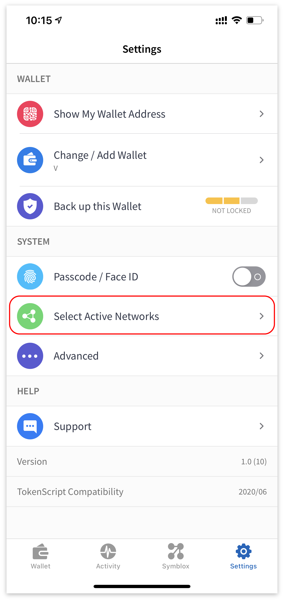

# Guía Cross-Chain para Móviles

##### Instalando Velas Defi Wallet  
Descarga Velas DeFi Wallet en https://symblox.io.  

# Configurando Velas Defi Wallet

Agregar la red de Ethereum.
  
 
  
Haga clic en la pestaña 'Ajustes', luego elija "Seleccionar redes activas"  

  

Elija 'Ethereum' y luego haga clic en 'Guardar'.

  

Añadiendo el contrato del token USDT para Ethereum y Velas.
  
 
  
Haga clic en la pestaña 'Monedero', luego haga clic en 'Añadir / Ocultar tokens'.

  

Haga clic en el signo '+'.  

  

Pegue la siguiente dirección en el campo 'Dirección del contrato' para agregar el token USDT en Ethereum. Los otros campos se completarán automáticamente cuando pegue la dirección.
USDT en Ethereum:**0xdAC17F958D2ee523a2206206994597C13D831ec7**  

  

Repita el proceso para agregar USDT en Velas.
USDT en Velas: **0x4b773e1ae1baa4894e51cc1d1faf485c91b1012f**  

  

Si aún no ha agregado el token SYX, puede repetir el proceso anterior para agregar SYX. 
Dirección del token SYX: **0x2de7063fe77aAFB5b401d65E5A108649Ec577170**  

    

Añadiendo contrato de token WETH para Ethereum y Velas.
  
 
  
Haga clic en la pestaña 'Monedero', luego haga clic en 'Añadir / Ocultar tokens'.

  

Haga clic en el signo '+'.  

  

Pegue la siguiente dirección en el campo 'Dirección del contrato' para agregar el token WETH en Ethereum. Los otros campos se completarán automáticamente cuando pegue la dirección.
WETH en Ethereum: **0xc02aaa39b223fe8d0a0e5c4f27ead9083c756cc2**  

  

Repita el proceso para agregar WETH en Velas: 
**V67RMNXTgYKi9CsmrSXvFfLAiubfWB5p34**  

  

    

 
# Utilizando TokenBridge  

Transfiriendo USDT en Ethereum a Velas blockchain.
  
 
  
Haga clic en la pestaña 'Symblox', luego vaya a la página de inicio: <a href="https://symblox.io/" target="_blank">https://symblox.io/</a>  
Haga clic en el botón 'Abrir Cross-Chain' o escriba en el campo de dirección:  
<a href="https://x.symblox.io/" target="_blank">https://x.symblox.io/</a>  

  

(1) Haga clic en el botón de menú.
(2) Si aún no ha elegido 'Ethereum' , haga clic en 'Conectado a:' para elegir la red Ethereum.

  

Elija 'Ethereum'.

  

Haga clic en 'Conectar Monedero'.

  

>The first time you use the cross-chain, the smart contract will require permission before accessing your wallet. Therefore it requires you to *unlock* before transferring.   

Ingrese la cantidad a transferir y luego haga clic en 'Unlock/Desbloquear'.

  

Haga clic en 'Confirmar' para enviar o haga clic en 'Editar' para cambiar manualmente las tarifas de gas.  

  

> Debido a la gran congestión en la red Ethereum, las transacciones pueden llevar mucho tiempo o incluso atascarse. Si ha esperado un período de tiempo suficiente y todavía está en la pantalla 'Cargando ...', intente volver a cargar la página web para ver si su transacción se ha liquidado.

  

Una vez que haya 'Desbloqueado', haga clic en 'Transferir'.

  

Verifique el monto de su transferencia y luego haga clic en 'Continuar'.

  

Después de la transferencia, puede verificar su 'Balance' para ver la cantidad transferida. 

  

Transfiriendo USDT de Velas de vuelta a la cadena de bloques Ethereum.

 

(1) Haga clic en el botón de menú.
(2) Si aún no está conectado a Velas, haga clic en 'Conectado a:' para cambiar su red actual.  

  

Elija 'Velas'.

  

Ingrese la cantidad a enviar y luego haga clic en 'Transfer/Transferir'.

  

Verifique la cantidad y luego haga clic en 'Continuar'.

  

  

Transferring WETH on Ethereum to Velas blockchain.
  
 

Dentro de la aplicación DeFi Wallet, vaya a la página de inicio. Luego haga clic en el botón 'Abrir Crosschain'. 

1. Haga clic en el menú.  
2. Haga clic en 'Conectado a:'

  

Haga clic en 'Ethereum'. 

  

1. Haga clic en 'Conectar Monedero'.
2. Haga clic en 'Wrap / Unwrap ETH' para cargar el widget Kyber.

  

Ingrese el monto a transferir y luego marque los términos de acuerdo. Presione siguiente para continuar.  

  

> Nota *** Asegúrese de tener suficiente ETH reservado para pagar las tarifas de transacción. 

Verifique la cantidad a intercambiar y luego haga clic en 'CONFIRMAR'.

  

Haga clic en 'Confirmar' para finalizar la transacción o haga clic en 'Editar' para cambiar las tarifas de gas.  

  

Opcionalmente, puede aumentar la tarifa para reducir el tiempo de espera. 

  

Una vez confirmada y transmitida, se crea una identificación de transacción.  

  

Desde la pantalla de Cross-Chain:
1. Haga clic en la lista desplegable.  
2. Elija WETH de la lista. 

  

1. Ingrese la cantidad de WETH para transferir a través del bridge.  
2. Haga clic en 'Unlock/Desbloquear' para permitir que el permiso del contrato inteligente interactúe con su monedero.  

  

> Nota *** Debido al intenso tráfico en Ethereum, se recomienda aumentar las tarifas del gas para reducir los tiempos de espera. 

Haga clic en 'Confirm/Confirmar' para finalizar o haga clic en 'Edit/Editar' para cambiar las tarifas de gas.  

  

Dependiendo del tráfico de la red, la transacción puede tardar unos minutos en confirmarse. Si está atascado en la pantalla "Cargando ..." durante unos minutos, puede volver a cargar la página para verificar si está desbloqueada. Se recomienda que aumente la tarifa del gas a fast/rápido para reducir el tiempo de espera.

  

Una vez desbloqueado:
1. Ingrese la cantidad de WETH que le gustaría transferir a Velas blockchain.
2. Haga clic en 'Transfer/Transferir' para continuar.

  

Confirme la transacción y luego haga clic en 'Accept/Aceptar' para continuar.

  

Haga clic en 'Confirmar' para finalizar o en 'Edit/Editar' para cambiar las tarifas de gas.

  

 

  

Transferring WETH on Velas back to Ethereum blockchain.
  
 

Desde la página de cross-chain:  
1. Haga clic en el menú.
2. Haga clic en 'Conectado a:'

  

Elija la red Velas.

  

Haga clic en 'Connect/Conectar Wallet', luego haga clic en la lista desplegable y elija 'WETH'.   

  

1. Ingrese la cantidad de WETH que se transferirá de regreso a la red Ethereum. 
2. Haga clic en 'Transfer/Transferir' para continuar. 

  

Confirm transaction and click 'OK' to continue.  

  

Espere a que se confirme la transacción. También puede hacer clic en la identificación de la transacción para realizar un seguimiento del progreso.

  

1. Haz clic en el menú.
2. Haga clic en 'Conectado a:'.

  

Elija la red Ethereum.

  

Haga clic en 'Wrap / Unwrap ETH' para cargar el widget Kyber.

  

Haga clic en el botón 'Swap/Cambiar' para que el 'Desde token' sea WETH. 

  

Ingrese la cantidad de WETH para convertir a ETH. Marque la casilla de los términos del acuerdo y haga clic en 'Siguiente'.  

  

Verifique la transacción y luego haga clic en 'APPROVE/APROBAR' para continuar.  

  

Haga clic en 'Confirm/Confirmar' para finalizar o en 'Edit/Editar' para cambiar el precio del gas. 

  

Haga clic en 'CONFIRM/CONFIRMAR' para finalizar la transacción. 

  

 

  

